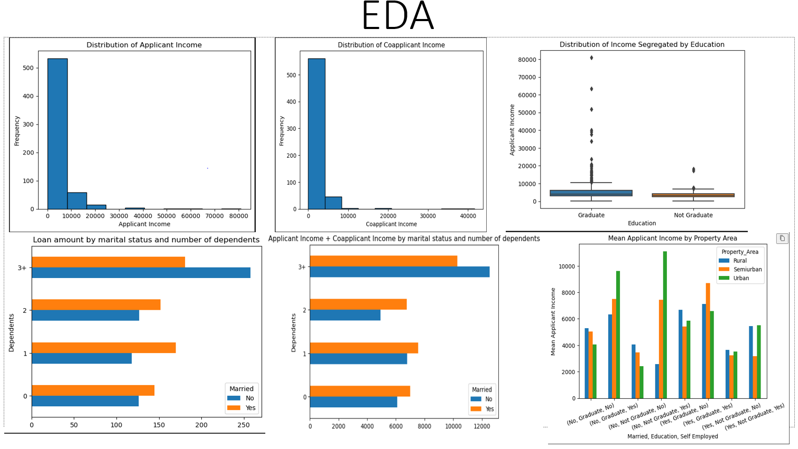
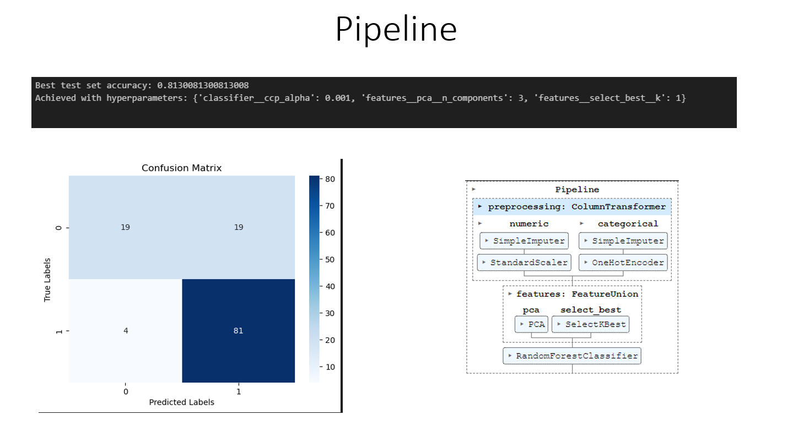
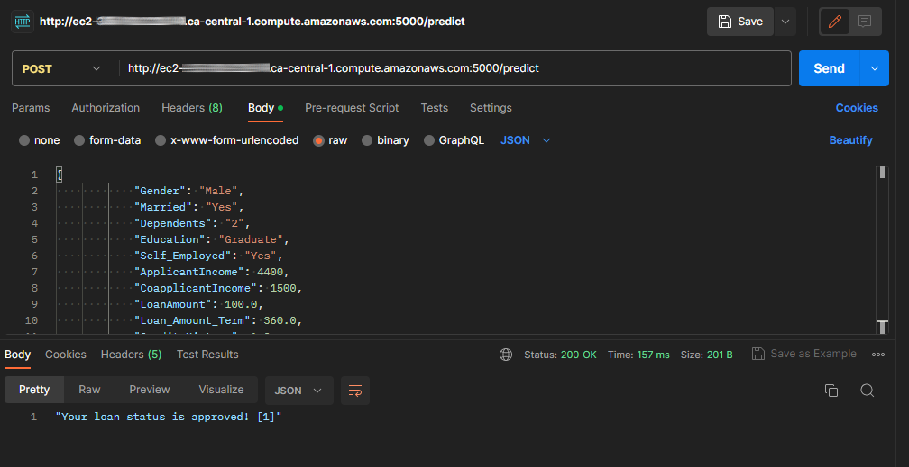

# Mini-project IV

### [Assignment](assignment.md)

## Project/Goals
The main goal of this project is to predict loan eligibility based on customer details and make API with Flask and make Deployment to Cloud (AWS).

## Detail of Dataset

|Variable| Description|
|:-|:-|
|Loan_ID| Unique Loan ID|
|Gender| Male/ Female|
|Married| Applicant married (Y/N)|
|Dependents| Number of dependents|
|Education| Applicant Education (Graduate/ Under Graduate)|
|Self_Employed| Self employed (Y/N)|
|ApplicantIncome| Applicant income|
|CoapplicantIncome| Coapplicant income|
|LoanAmount| Loan amount in thousands|
|Loan_Amount_Term| Term of loan in months|
|Credit_History| credit history meets guidelines|
|Property_Area| Urban/ Semi Urban/ Rural|
|Loan_Status| Loan approved (Y/N)

## Process

### Steps:
- EDA

- Data Preparation, Data Cleaning

- Feature Engineering

- Model development (LogisticRegression, RandomForestClassifier)

- Optimization model with HyperParameter (GridSearchCV) 

- Pipelines

- Model Persistance

- Flask - building an API

- Deployment to Cloud (AWS)

## Results/Demo

## Challanges 
It was challenging part with pipeline, bilding API and deployment on Cloud.

## Future Goals
I need spend more time to ptactice part with pipeline, bilding API and deployment on Cloud.